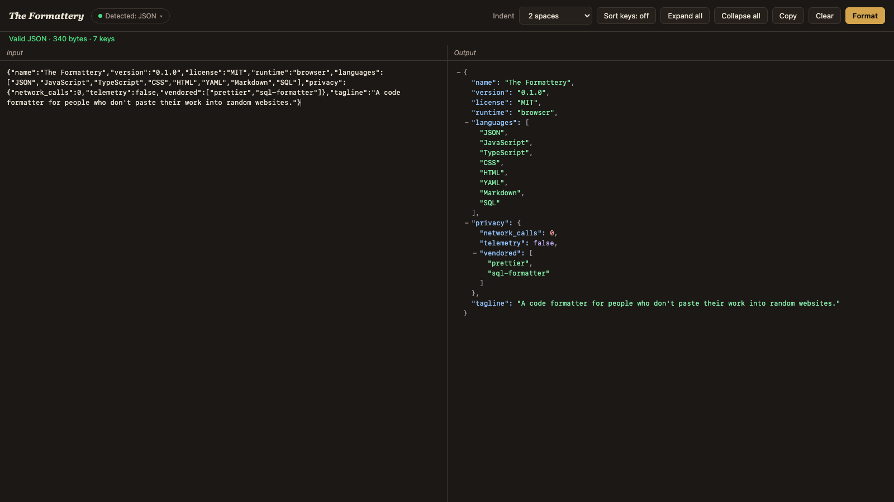

# The Formattery

*A code formatter for people who don't paste their work into random websites.*

One HTML file. Auto-detects about fifteen languages. Runs entirely in your browser. Nothing leaves the page.

[**Live demo →**](https://russnem.github.io/formattery/) · The page itself runs offline; the link just lets you try it without downloading first.

---

## Why this exists

Most online formatters want you to paste your code into a website. The site may save it. It may have third-party trackers reading the page. Its behavior can change tomorrow without you noticing — you re-download its code on every visit. Pasting an API response with a bearer token, a customer record, or a piece of proprietary source into one of those is a small, common, easy way to leak something you'd rather not.

The Formattery exists because that bothered me. It's a single HTML file that runs locally in your browser. Everything it depends on — [Prettier](https://prettier.io) and [sql-formatter](https://github.com/sql-formatter-org/sql-formatter) — is vendored into the repository. There is no server, no analytics, no telemetry, no account, no network call at runtime. You can verify that by opening the file and disabling your network — it still works.

It is not better than every alternative. It is better than every alternative *for code you can't responsibly hand to a website you don't control.*

---

## What it does

- **Paste anything. It figures out the language.** JSON, JavaScript, TypeScript, CSS, SCSS, Less, HTML, YAML, Markdown, GraphQL, SQL — detected by actually attempting to parse, not by regex sniffing.
- **JSON gets an interactive collapsible tree.** Every object and array has a `+` / `−` toggle. Sort keys. Expand and collapse all. Syntax-highlighted.
- **Other languages get formatted text** via [Prettier](https://prettier.io) (running locally, not via their playground) or `sql-formatter`.
- **Quiet override.** If detection ever guesses wrong, click the *Detected: …* pill at the top of the page to lock a language manually.
- **Indent picker.** 2 spaces, 4 spaces, tab, or minified JSON output for Copy.

---

## How to run it

Double-click `index.html`. That's it.

Or drag it into any modern browser. Or put it on a USB stick. Or email it to yourself. The whole thing is roughly 2 MB on disk, almost all of which is the vendored Prettier bundle.

No build step. No `npm install`. No server. No configuration file.

**Try a sample without typing anything.** Append `?demo=json`, `?demo=js`, `?demo=css`, or `?demo=sql` to the URL to prefill the input.

---

## The privacy story, in one paragraph

Nothing is transmitted. There are no `fetch` calls, no analytics, no service workers, no third-party scripts. Prettier and sql-formatter are vendored locally under `vendor/` with their original LICENSE files retained — there is no CDN at runtime. The page itself is one HTML file you can read top to bottom (about five hundred lines), plus those third-party formatters in `vendor/`. If your security team needs a one-pager: it is an HTML document, opened in the browser, using only local resources, with no network activity at runtime.

---

## Languages currently covered

| Family | Languages |
| --- | --- |
| Data | JSON, JSON5 |
| JavaScript | JavaScript, JSX, TypeScript, TSX |
| Styles | CSS, SCSS, Less |
| Markup | HTML, Vue templates, Angular templates |
| Docs | Markdown, MDX |
| Config | YAML |
| Schemas | GraphQL |
| Databases | SQL (most dialects) |

Languages with native-only formatters — Python, Go, Rust, C, C++, Java — are not currently supported. They would require either a heavy in-browser WASM runtime (such as Pyodide for Python) or a small local helper that shells out to native tooling. Issues and pull requests welcome if either path is interesting.

---

## Credits

- **[Prettier](https://prettier.io)** by James Long and contributors — vendored at version 3.3.3, MIT-licensed. The standalone build and the plugins for `babel`, `estree`, `typescript`, `postcss`, `html`, `markdown`, `yaml`, and `graphql` are included under `vendor/prettier/`.
- **[sql-formatter](https://github.com/sql-formatter-org/sql-formatter)** by ZeroTurnaround LLC and contributors — vendored at version 15.4.5, MIT-licensed. Included under `vendor/sql-formatter/`.

Full attribution and license terms are in [NOTICE](./NOTICE) and the LICENSE files inside `vendor/`.

---

## License

MIT — see [LICENSE](./LICENSE).

Copyright © 2026 Merano Studio.
